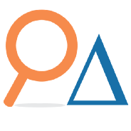

This is a summary page for some side projects I've worked on. See [consulting projects here](/consulting).

## Machine Learning Course

### [Delta Analytics](http://www.deltanalytics.org/)

I am proud to have contributed to an open data science/machine learning course with foundational theory and coding examples to help non-profit or other social good learners translate their data into actionable insights.

This course is available on [Github](https://github.com/DeltaAnalytics/machine_learning_for_good).

See more at the [Delta Analytics Machine Learning for Good page](http://www.deltanalytics.org/curriculum.html).

## Handy

### [R package](/2018-02-26-handy-package/)

This package helps to handle common data tasks. Make importing and summarizing data a breeze.

## Crypto Market Trends

### [Shiny App](https://kevinrpan.shinyapps.io/coin-market-trends/)

Daily, hourly, and weekly quick look at top cryptocurrency trends.

## Foosball

### [Shiny App](/2016-11-30-foosball/)

This analyzes foosball performance of players across Brattle offices.

## NCAA predictions

### [Kaggle Analysis](https://www.kaggle.com/kevinpan/march-madness-elo-rankings)

This is an analysis on NCAA games to guess March Madness winners based on historical performance.

## Kiva Loan Analysis

### [Kiva Loan Analysis](/kiva)

A data visualization to understand the underlying details for Kiva microloans. Highlight is the interactive map.
