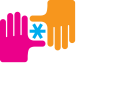

## BUILD 
### Delta Analytics 

For [BUILD](https://build.org/), the question to answer is [are we improving the academic and professional outcomes of our students?](https://blog.deltanalytics.org/asking-the-right-data-questions-a14cb37dc177)

## Machine Learning Course
### Delta Analytics

How can *you* use data for good? Helping to provide foundational theory and coding to translate data into actionable insights for everyone. See more at the [Delta Analytics Machine Learning for Good page](http://www.deltanalytics.org/curriculum.html).

## Bernoulli One
### Wharton Digital Health Club 

Early detection of critical events saves lives. How can we detect these more accurately?
See more at [BernoulliHealth.com](http://bernoullihealth.com/)
